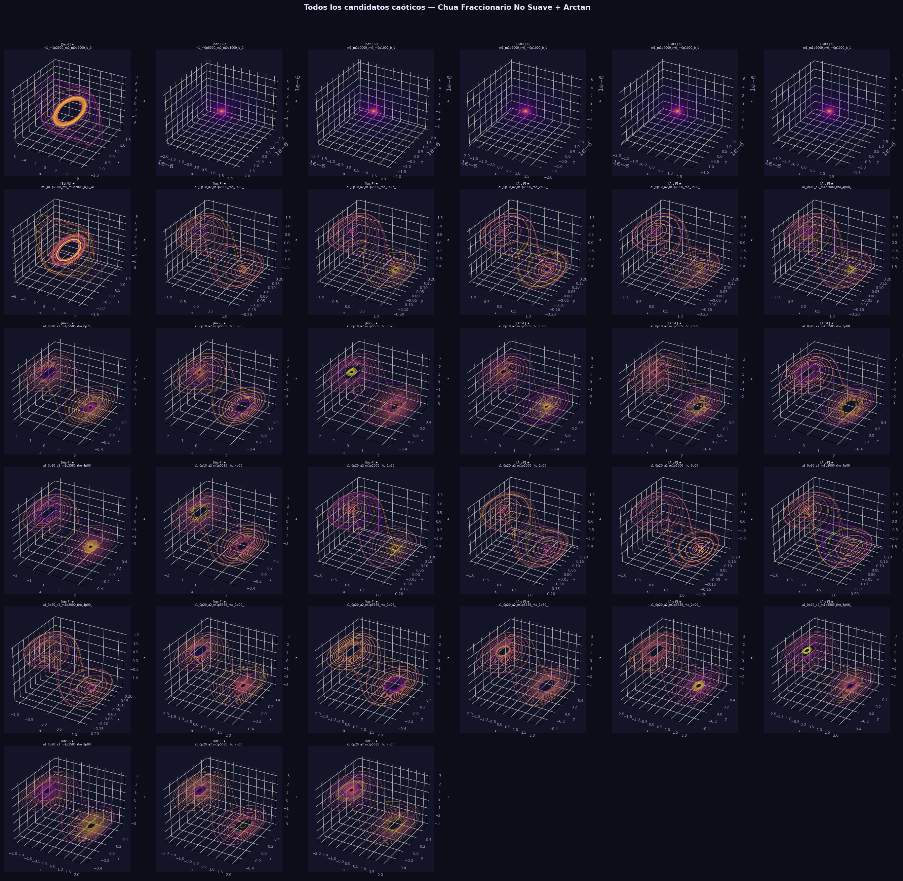
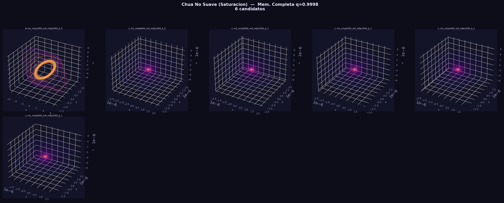
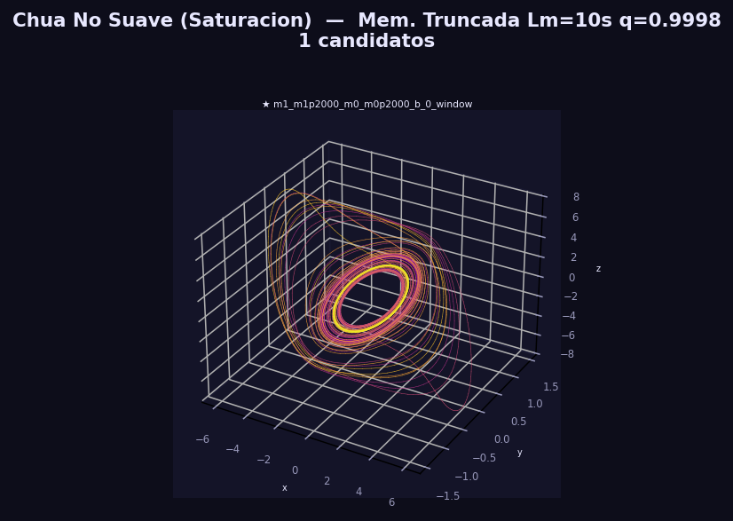
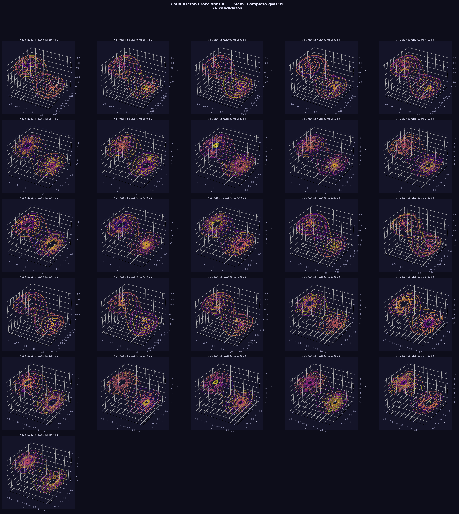
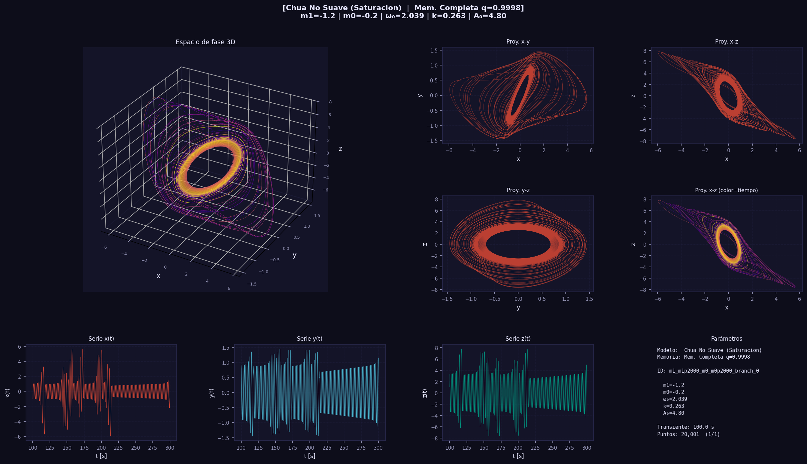
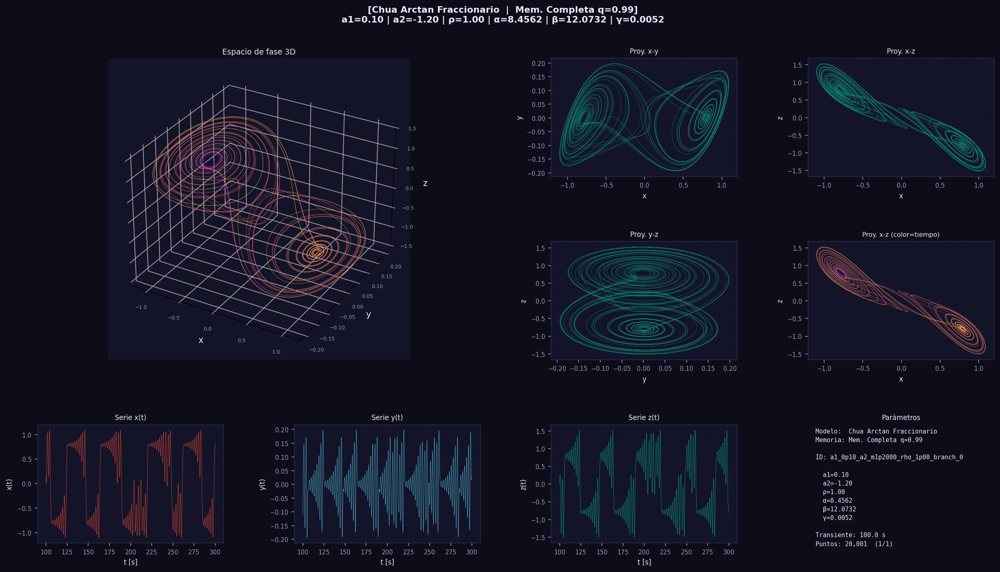
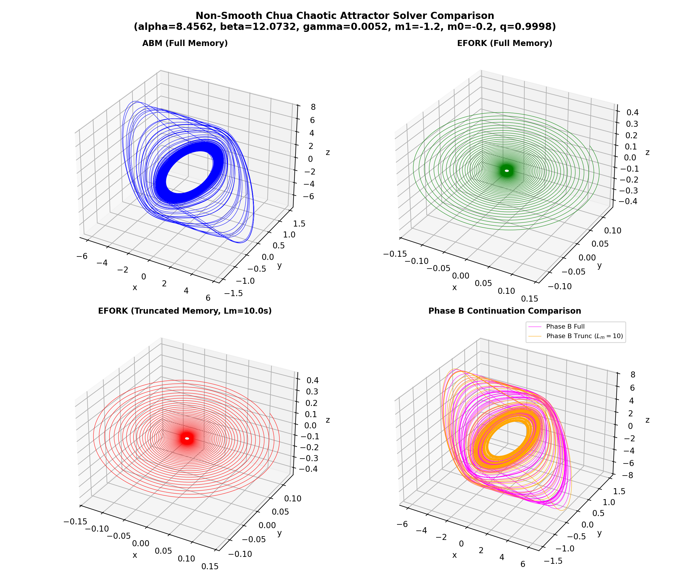

# Resumen Metodológico para Selección de Candidatos a Ocultedad

> [!NOTE]
> Fecha de consolidación: **2026-06-07**
> Este archivo separa los flujos usados en las últimas corridas para no mezclar reproducción de resultados publicados con la metodología propuesta. El objetivo es dejar una tabla de decisión para escoger, en una etapa posterior, los candidatos que recibirán prueba de ocultedad.

---

## 1. Inventario de Artefactos Revisados

| Grupo | Archivo / Directorio | Rol |
|:------|:---------------------|:----|
| Resumen global reciente | `exploration_summary.md` | Resumen narrativo de las corridas nuevas de saturación y arctan fraccionario. |
| Candidatos arctan propuestos | `outputs/arctan_search_seed0p99_mem_full/summary.csv` | Barrido arctan con semilla DF fraccionaria y memoria completa. |
| Arctan con memoria truncada | `outputs/arctan_search_seed0p99_mem_window/summary.csv` | Mismo barrido arctan, pero con ventana de memoria `Lm=10 s`. |
| Saturación, semilla publicada | `outputs/saturation_search_seed1_mem_full_sweep/summary.csv` | Barrido de saturación con semilla DF de orden entero y dinámica fraccionaria. |
| Saturación, semilla fraccionaria | `outputs/saturation_search_seed0p9998_mem_full_sweep/summary.csv` | Barrido de saturación con semilla DF `q=0.9998`, memoria completa. |
| Saturación, truncada | `outputs/saturation_search_seed0p9998_mem_window_sweep/summary.csv` | Barrido de saturación con semilla DF `q=0.9998`, memoria truncada. |
| Comparación de solucionadores | `outputs/saturation_comparison/` | Reintegración del candidato fuerte de saturación con ABM y EFORK. |
| Búsquedas exploratorias previas | `version_2/outputs/arctan_full_memory_search/run_*/summary.json` | Corridas arctan exploratorias con contrato de reproducción `published_integer_laplace`. |
| Registro Lyapunov | `version_2/hidden_attractors/analysis/lyapunov_methods.py` | Identificadores, alcance y estado de validación de métodos Lyapunov. |
| API Lyapunov | `version_2/hidden_attractors/analysis/lyapunov_api.py` | `compute_lyapunov_spectrum` y validación de compatibilidad por método, `q` y memoria. |

---

## 2. Función Descriptiva: Separar Reproducción Publicada y Metodología Propuesta

La primera separación crítica es la función de transferencia usada para generar semillas. No deben combinarse en la misma afirmación metodológica.

| Flujo | Nombre en código | Transferencia usada | Propósito | Estado metodológico |
|:------|:----------------|:--------------------|:----------|:--------------------|
| **Reproducción publicada** | `published_integer_laplace` / `integer` | `W(jω)` | Reproducir semillas y condiciones armónicas usadas en artículos con balance armónico clásico. | Flujo de comparación/reproducción. No es la propuesta fraccionaria nueva. |
| **Metodología propuesta** | `fractional_spectral` / `fractional` | `W_q(jω) = rᵀ[(jω)^q I − P)⁻¹]b` | Incorporar la fase fraccionaria en la condición armónica de la semilla. | Flujo propuesto para candidatos fraccionarios Caputo. |

### Evidencia Observada por Flujo DF

| Flujo DF | Corridas revisadas | Resultado principal |
|:---------|:------------------|:--------------------|
| `W(jω)` publicado | `version_2/outputs/arctan_full_memory_search/run_*/summary.json`; 28 carpetas, 27 con `summary.json` y una carpeta vacía `run_20260605_190006`. | 2749 casos evaluados; 163 candidatos aceptados, todos `nonperiodic_candidate`; **0** `chaotic_candidate_pending_robustness`. Tratar como exploratorios/reproducción, no como candidatos fuertes. |
| `W_q(jω)` propuesto | `outputs/arctan_search_seed0p99_mem_full/summary.csv` y `outputs/arctan_search_seed0p99_mem_window/summary.csv`. | Memoria completa: 177 ramas, **26 candidatos fuertes** arctan. Memoria truncada `Lm=10 s`: 177 fallos de continuación. |
| Saturación con semilla `q=1` | `outputs/saturation_search_seed1_mem_full_sweep/summary.csv`. | 21 ramas; **1 candidato fuerte** y 6 no periódicos. Uno de los no periódicos con `diverged_early`. |
| Saturación con semilla `q=0.9998` | `outputs/saturation_search_seed0p9998_mem_full_sweep/summary.csv` y `...mem_window_sweep/summary.csv`. | El candidato `m1=-1.2, m0=-0.2, branch_0` aparece fuerte tanto con memoria completa como truncada. |

---

## 3. Continuación Numérica: Separar Entera y Fraccionaria

La segunda separación es la forma en que se transfiere la semilla desde el sistema lineal/deformado hasta el sistema no lineal completo.

| Flujo | Variante | Cómo avanza | Propósito | Etiqueta recomendada |
|:------|:---------|:------------|:----------|:---------------------|
| Reproducción publicada | Continuación entera / reinicio por punto final | El punto final se usa como punto inicial del siguiente tramo. No se transporta historia Caputo completa. | Reproducir flujos de artículos o implementaciones clásicas. | `published_reproduction_restart` |
| Propuesta fraccionaria | ABM Caputo — **memoria completa** | La continuación conserva historia Caputo completa durante los pasos de `η`. | Metodología propuesta con memoria causal completa. | `proposed_fractional_full_memory` |
| Propuesta fraccionaria | ABM Caputo — **memoria truncada** | La continuación conserva solo una ventana, ej. `Lm=10 s`. | Prueba de robustez computacional bajo memoria corta. | `proposed_fractional_window_memory` |

### Variantes Observadas en Código / Salidas

| Implementación | Archivo | Memoria | Comentario |
|:--------------|:--------|:--------|:-----------|
| `run_fractional_continuation(..., memory_mode="full")` | `search_arctan_fractional.py`, `search_saturation_candidates.py` | Completa | Flujo propuesto principal para candidatos fraccionarios. |
| `run_fractional_continuation(..., memory_mode="window")` | `search_arctan_fractional.py`, `search_saturation_candidates.py` | Truncada | Prueba de sensibilidad a longitud de memoria. |
| `abm_full` | `version_2/tools/search_arctan_full_memory_candidates.py` | Completa | Usado en corridas exploratorias `version_2`. |
| `abm_restart` | `version_2/tools/search_arctan_full_memory_candidates.py` | Reinicio por punto final | Reproducción o exploración sin historia Caputo acumulada. |
| `adm_restart` | `version_2/tools/search_arctan_full_memory_candidates.py` | Reinicio local ADM | Reproducción tipo Wu 2023/local; no representa memoria Caputo completa. |

---

## 4. Simulaciones Largas: Separar Método y Memoria

Después de la continuación, cada candidato debe integrarse largo tiempo y registrar explícitamente método numérico y memoria.

| Familia | Método | Memoria | Salida | Uso |
|:--------|:-------|:--------|:-------|:----|
| Arctan | ABM Caputo | Completa | `outputs/arctan_search_seed0p99_mem_full/*_trajectory.csv` | Simulación larga principal — 26 candidatos fuertes. |
| Arctan | ABM Caputo | Ventana `Lm=10 s` | `outputs/arctan_search_seed0p99_mem_window/summary.csv` | No produjo candidatos — continuación falló. |
| Arctan | ADM / ABM / EFORK trunc / EFORK comp. | Mixto | `chaotic_candidates_summary.md` y figuras | Comparación cualitativa posterior, no búsqueda primaria. |
| Saturación | ABM Caputo | Completa | `outputs/saturation_search_seed*_mem_full_sweep/*_trajectory.csv` | Búsqueda primaria. |
| Saturación | ABM Caputo | Ventana `Lm=10 s` | `outputs/saturation_search_seed0p9998_mem_window_sweep/*_trajectory.csv` | Robustez a memoria truncada. |
| Saturación | EFORK-3 | Completa | `outputs/saturation_comparison/trajectory_efork_full.csv` | Reintegración del candidato fuerte `m1=-1.2, m0=-0.2`. |
| Saturación | EFORK-3 | Ventana `Lm=10 s` | `outputs/saturation_comparison/trajectory_efork_trunc.csv` | Reintegración con memoria corta del mismo candidato fuerte. |

### Campos Requeridos para Nuevas Simulaciones Largas

| Campo | Ejemplo |
|:------|:--------|
| `candidate_id` | `a1_0p10_a2_m1p2000_rho_1p00_branch_0` |
| `seed_transfer_mode` | `published_integer_laplace` o `fractional_spectral` |
| `continuation_mode` | `published_reproduction_restart`, `proposed_fractional_full_memory`, `proposed_fractional_window_memory` |
| `integrator` | `ABM`, `ADM_WU2023`, `EFORK3` |
| `memory_mode` | `not_applicable`, `full`, `window`, `restart` |
| `memory_window_time` | `10 s`, `40 s`, o `NA` |
| `q` | `1`, `0.9998`, `0.99`, etc. |
| `h`, `t_final`, `t_transient` | Contrato numérico exacto |
| `trajectory_path` | Ruta al CSV usado para diagnóstico |

---

## 5. Diagnóstico: De Periodicidad a Pruebas de Caos con Lyapunov

El clasificador `classify_post_transient_periodicity` sirve como filtro inicial, pero **no debe ser la prueba final de caos**. La siguiente etapa debe usar los métodos Lyapunov registrados en la librería.

### API y Métodos Disponibles

| Método ID | Tipo | Soporte `q` | Memoria | Estado y uso recomendado |
|:----------|:-----|:-----------:|:--------|:------------------------|
| `integer_qr_benettin` | Variacional entero QR-Benettin | `q=1` únicamente | No aplica | ✅ Validado para sistemas enteros. **No usar** para Caputo `q<1`. |
| `fractional_variational_abm_qr` | Variacional Caputo ABM-QR | `0 < q < 1` | `full` o `window` | ⚠️ Método fraccionario propuesto. Implementado pero **no validado** contra benchmarks publicados. |
| `fractional_variational_dk2018_block_restart_abm_gs` | Reproducción DK2018 ABM-GS con reinicios | `0 < q < 1` | `dk2018_block_restart_abm_gs` | Flujo de reproducción publicada. Discrepancia documentada. |
| `fractional_cloned_dynamics_abm_gs_published` | Dinámica clonada, Gram-Schmidt | `0 < q ≤ 1` | `published_block_restart` | ⚠️ Con discrepancias pendientes frente a benchmarks Fischer 2020. Evidencia complementaria. |
| `fractional_cloned_dynamics_abm_qr` | Dinámica clonada, QR experimental | `0 < q ≤ 1` | `experimental_qr_block_restart` | Variante experimental interna. Solo para comparación de sensibilidad. |
| `fractional_cloned_dynamics_abm` | Dinámica clonada | `0 < q < 1` | Pendiente | ❌ No implementado; **no usar** para selección. |

### Regla Propuesta para Pruebas de Caos antes de Ocultedad

| Tipo de candidato | Método Lyapunov principal | Método secundario | Nota |
|:-----------------|:--------------------------|:------------------|:-----|
| Entero `q=1` | `integer_qr_benettin` | FFT/PSD, Poincaré, 0-1 como apoyo | Único método Lyapunov validado contra benchmarks publicados. |
| Arctan fraccionario suave `q<1` | `fractional_variational_abm_qr` full-memory | `fractional_cloned_dynamics_abm_gs_published` como contraste | Arctan es suave; admite Jacobiano. Reportar siempre que el método fraccionario aún no está validado. |
| Arctan fraccionario — prueba de memoria corta | `fractional_variational_abm_qr` window-memory | Comparar contra full-memory | Usar como robustez, no como reemplazo automático del full-memory. |
| Saturación/no suave `q<1` | `fractional_cloned_dynamics_abm_gs_published` | `fractional_variational_abm_qr` solo con advertencia | La saturación no es suave; el método variacional con Jacobiano tiene problema en superficies de conmutación. |
| Reproducción DK2018 | `fractional_variational_dk2018_block_restart_abm_gs` | Ninguno como cierre automático | Mantener separado de la metodología propuesta; hay discrepancias reproducidas. |

---

## 6. Resultados Actuales por Metodología

---

### 6.1 Arctan — Metodología Propuesta `W_q(jω)` + Continuación Fraccionaria Full-Memory

> [!IMPORTANT]
> Archivo: `outputs/arctan_search_seed0p99_mem_full/summary.csv`

| Total ramas | Continuación `ok` | Fallos continuación | Caóticos fuertes ⭐ | No periódicos ○ | Periódicos rechazados | Delgados periódicos |
|:-----------:|:-----------------:|:-------------------:|:------------------:|:---------------:|:---------------------:|:-------------------:|
| 177 | 173 | 4 | **26** | 54 | 90 | 3 |

**Distribución de los 26 candidatos fuertes por región:**

| Región | Conteo |
|:-------|:------:|
| `a1=0.1, a2=-1.2` | 5 |
| `a1=0.1, a2=-1.5585` | 8 |
| `a1=0.2, a2=-1.2` | 5 |
| `a1=0.2, a2=-1.5585` | 8 |

**Lista completa de candidatos fuertes arctan:**

| # | Candidato ID | `a1` | `a2` | `ρ` | Rama | `ω₀` | `k` | `A₀` |
|:-:|:------------|:----:|:----:|:---:|:----:|:----:|:---:|:----:|
| 1 | `a1_0p10_a2_m1p2000_rho_1p00_branch_0` ⭐ | 0.10 | -1.2000 | 1.00 | 0 | 2.0992 | -1.0283 | 0.8829 |
| 2 | `a1_0p10_a2_m1p2000_rho_1p25_branch_0` ⭐ | 0.10 | -1.2000 | 1.25 | 0 | 2.0992 | -1.0283 | 1.3089 |
| 3 | `a1_0p10_a2_m1p2000_rho_2p00_branch_0` ⭐ | 0.10 | -1.2000 | 2.00 | 0 | 2.0992 | -1.0283 | 1.7645 |
| 4 | `a1_0p10_a2_m1p2000_rho_3p00_branch_0` ⭐ | 0.10 | -1.2000 | 3.00 | 0 | 2.0992 | -1.0283 | 1.9727 |
| 5 | `a1_0p10_a2_m1p2000_rho_4p00_branch_0` ⭐ | 0.10 | -1.2000 | 4.00 | 0 | 2.0992 | -1.0283 | 2.0690 |
| 6 | `a1_0p10_a2_m1p5585_rho_0p75_branch_0` ⭐ | 0.10 | -1.5585 | 0.75 | 0 | 2.0992 | -1.0283 | 1.0513 |
| 7 | `a1_0p10_a2_m1p5585_rho_1p00_branch_0` ⭐ | 0.10 | -1.5585 | 1.00 | 0 | 2.0992 | -1.0283 | 1.7681 |
| 8 | `a1_0p10_a2_m1p5585_rho_1p25_branch_0` ⭐ | 0.10 | -1.5585 | 1.25 | 0 | 2.0992 | -1.0283 | 2.0829 |
| 9 | `a1_0p10_a2_m1p5585_rho_1p50_branch_0` ⭐ | 0.10 | -1.5585 | 1.50 | 0 | 2.0992 | -1.0283 | 2.2687 |
| 10 | `a1_0p10_a2_m1p5585_rho_2p00_branch_0` ⭐ | 0.10 | -1.5585 | 2.00 | 0 | 2.0992 | -1.0283 | 2.4814 |
| 11 | `a1_0p10_a2_m1p5585_rho_3p00_branch_0` ⭐ | 0.10 | -1.5585 | 3.00 | 0 | 2.0992 | -1.0283 | 2.6773 |
| 12 | `a1_0p10_a2_m1p5585_rho_4p00_branch_0` ⭐ | 0.10 | -1.5585 | 4.00 | 0 | 2.0992 | -1.0283 | 2.7700 |
| 13 | `a1_0p10_a2_m1p5585_rho_4p00_branch_1` ⭐ | 0.10 | -1.5585 | 4.00 | 1 | 3.2214 | -0.4147 | 7.2616 |
| 14 | `a1_0p20_a2_m1p2000_rho_1p25_branch_0` ⭐ | 0.20 | -1.2000 | 1.25 | 0 | 2.0992 | -1.1283 | 1.0589 |
| 15 | `a1_0p20_a2_m1p2000_rho_2p00_branch_0` ⭐ | 0.20 | -1.2000 | 2.00 | 0 | 2.0992 | -1.1283 | 1.5484 |
| 16 | `a1_0p20_a2_m1p2000_rho_3p00_branch_0` ⭐ | 0.20 | -1.2000 | 3.00 | 0 | 2.0992 | -1.1283 | 1.7626 |
| 17 | `a1_0p20_a2_m1p2000_rho_4p00_branch_0` ⭐ | 0.20 | -1.2000 | 4.00 | 0 | 2.0992 | -1.1283 | 1.8604 |
| 18 | `a1_0p20_a2_m1p2000_rho_4p00_branch_1` ⭐ | 0.20 | -1.2000 | 4.00 | 1 | 3.2214 | -0.5147 | 4.4057 |
| 19 | `a1_0p20_a2_m1p5585_rho_1p00_branch_0` ⭐ | 0.20 | -1.5585 | 1.00 | 0 | 2.0992 | -1.1283 | 1.4515 |
| 20 | `a1_0p20_a2_m1p5585_rho_1p25_branch_0` ⭐ | 0.20 | -1.5585 | 1.25 | 0 | 2.0992 | -1.1283 | 1.7922 |
| 21 | `a1_0p20_a2_m1p5585_rho_1p50_branch_0` ⭐ | 0.20 | -1.5585 | 1.50 | 0 | 2.0992 | -1.1283 | 1.9871 |
| 22 | `a1_0p20_a2_m1p5585_rho_2p00_branch_0` ⭐ | 0.20 | -1.5585 | 2.00 | 0 | 2.0992 | -1.1283 | 2.2067 |
| 23 | `a1_0p20_a2_m1p5585_rho_3p00_branch_0` ⭐ | 0.20 | -1.5585 | 3.00 | 0 | 2.0992 | -1.1283 | 2.4063 |
| 24 | `a1_0p20_a2_m1p5585_rho_3p00_branch_1` ⭐ | 0.20 | -1.5585 | 3.00 | 1 | 3.2214 | -0.5147 | 5.7127 |
| 25 | `a1_0p20_a2_m1p5585_rho_4p00_branch_0` ⭐ | 0.20 | -1.5585 | 4.00 | 0 | 2.0992 | -1.1283 | 2.5002 |
| 26 | `a1_0p20_a2_m1p5585_rho_4p00_branch_1` ⭐ | 0.20 | -1.5585 | 4.00 | 1 | 3.2214 | -0.5147 | 5.8004 |

---

### 6.2 Arctan con Metodología Propuesta — Memoria Truncada

> [!WARNING]
> Archivo: `outputs/arctan_search_seed0p99_mem_window/summary.csv`

| Total ramas | Resultado |
|:-----------:|:----------|
| 177 | **177 `continuation_failed`** por `diverged_early`. Ninguno pasa a selección de ocultedad por este flujo. |

La ventana `Lm=10 s` no fue suficiente para sostener la continuación arctan. Esto no invalida automáticamente los candidatos full-memory, pero exige que la etapa Lyapunov y la prueba de ocultedad se hagan inicialmente con memoria completa y que la memoria truncada quede como prueba de sensibilidad.

---

### 6.3 Saturación

| Corrida | Archivo | Candidato fuerte | Observación |
|:--------|:--------|:----------------:|:------------|
| Semilla `q=1`, memoria completa | `.../saturation_search_seed1_mem_full_sweep/summary.csv` | `m1_m1p2000_m0_m0p2000_branch_0` ⭐ | 1 fuerte + varios no periódicos. Revisar `simulation_status` antes de promover. |
| Semilla `q=0.9998`, memoria completa | `.../saturation_search_seed0p9998_mem_full_sweep/summary.csv` | `m1_m1p2000_m0_m0p2000_branch_0` ⭐ | El mismo candidato fuerte persiste. |
| Semilla `q=0.9998`, memoria truncada | `.../saturation_search_seed0p9998_mem_window_sweep/summary.csv` | `m1_m1p2000_m0_m0p2000_branch_0` ⭐ | El mismo candidato fuerte persiste con `Lm=10 s`. |

> [!IMPORTANT]
> **Candidato de saturación prioritario** — robusto en todos los modos de memoria:

| Candidato ID | `m1` | `m0` | Rama | `ω₀` | `k` | `A₀` | Estado |
|:------------|:----:|:----:|:----:|:----:|:---:|:----:|:-------|
| `m1_m1p2000_m0_m0p2000_branch_0` ⭐ | -1.2 | -0.2 | 0 | ~2.039–2.040 | ~0.263 | ~4.80 | **Fuerte en full-memory y window-memory.** |

---

## 7. Tabla de Decisión para Candidatos a Prueba de Ocultedad

| Prioridad | Grupo | Criterio de entrada a Lyapunov | Método Lyapunov | Pasa a ocultedad si |
|:---------:|:------|:-------------------------------|:----------------|:--------------------|
| **1** | Saturación `m1=-1.2, m0=-0.2` ⭐ | Fuerte en memoria completa y truncada; trayectoria `ok/ok`. | Cloned dynamics fraccionario como evidencia principal por no suavidad; ABM-QR solo con advertencia. | `λ_max > 0` bajo contrato finito y sin contradicciones graves con trayectoria/sensibilidad. |
| **2** | Arctan `a1=0.1, a2=-1.2`, ramas fuertes | Fuerte en full-memory, amplitudes menores. | `fractional_variational_abm_qr` full-memory. | `λ_max > 0` y estabilidad cualitativa bajo reintegración. |
| **3** | Arctan `a1=0.1, a2=-1.5585`, ramas fuertes | Fuerte en full-memory y región robusta del barrido. | `fractional_variational_abm_qr` full-memory. | Igual que prioridad 2. |
| **4** | Arctan `a1=0.2, a2=-1.2/-1.5585` | Fuerte en full-memory. | `fractional_variational_abm_qr` full-memory. | Igual que prioridad 2. |
| **5** | `version_2` `published_integer_laplace` no periódicos | Solo pantalla exploratoria; no fuertes. | Usar según `q`: entero `integer_qr_benettin`; fraccionario método correspondiente. | Solo si Lyapunov y reintegración los promueven; no son prioridad inicial. |

---

## 8. Reglas de Cierre para el Siguiente Paso

> [!CAUTION]
> Reglas metodológicas que **no deben violarse** al reportar resultados:

1. ❌ No llamar "caótico validado" a un candidato solo por `chaotic_candidate_pending_robustness`.
2. ❌ No mezclar `W(jω)` con `W_q(jω)` en una misma conclusión.
3. ❌ No usar `integer_qr_benettin` para Caputo `q<1`.
4. ✅ Registrar siempre si la continuación fue `restart`, `full` o `window`.
5. ✅ Para arctan fraccionario suave, usar primero `fractional_variational_abm_qr` full-memory.
6. ✅ Para saturación no suave, preferir evidencia Lyapunov sin Jacobiano o reportar explícitamente la limitación del Jacobiano.
7. ✅ La prueba de ocultedad debe ejecutarse **solo después** de seleccionar candidatos con evidencia Lyapunov positiva bajo un contrato numérico registrado.

---

## 9. Candidatos Recomendados para la Primera Tanda Lyapunov

| Orden | Candidato | Motivo |
|:-----:|:----------|:-------|
| **1** | `m1_m1p2000_m0_m0p2000_branch_0` ⭐ | Único candidato fuerte de saturación que persiste en full y window. |
| **2** | `a1_0p10_a2_m1p2000_rho_1p00_branch_0` | Arctan fuerte con amplitud relativamente baja; buen primer caso para ocultedad si Lyapunov confirma. |
| **3** | `a1_0p10_a2_m1p2000_rho_1p25_branch_0` | Mismo núcleo dinámico, ρ ligeramente mayor. |
| **4** | `a1_0p10_a2_m1p5585_rho_0p75_branch_0` | Región `a2=-1.5585` con ρ mínimo entre fuertes. |
| **5** | `a1_0p10_a2_m1p5585_rho_1p00_branch_0` | Región `a2=-1.5585`, caso representativo. |
| **6** | `a1_0p20_a2_m1p2000_rho_1p25_branch_0` | Contraste con `a1=0.2` en región `a2=-1.2`. |
| **7** | `a1_0p20_a2_m1p5585_rho_1p00_branch_0` | Contraste con `a1=0.2` en región `a2=-1.5585`. |

> [!TIP]
> Estos siete forman una primera tanda razonable: un candidato de saturación robusto y seis arctan representativos de las dos regiones principales. Después de Lyapunov se decide cuáles pasan al protocolo de ocultedad.

---

## 10. Galería de Figuras

### Figura Global — Todos los Candidatos (37 paneles)

---

### Mosaico — Saturación, Memoria Completa (6 candidatos)

---

### Mosaico — Saturación, Memoria Truncada (1 candidato confirmado)

---

### Mosaico — Arctan Fraccionario, Memoria Completa (26 candidatos)

---

### Detalle — Candidato Caótico Saturación (`m1=-1.2, m0=-0.2`)

---

### Detalle — Candidato Caótico Arctan (`a1=0.1, a2=-1.2, ρ=1.0`)

---

### Detalle — Candidato Saturación con 4 Solucionadores (`m1=-1.2, m0=-0.2`)

