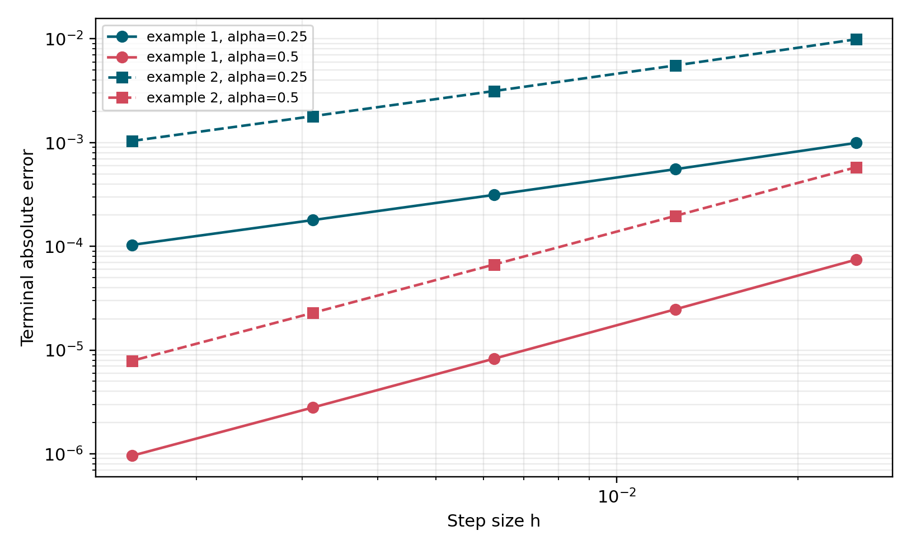

# EFORK-3 Published Validation

The three-stage EFORK numerical method is validated independently of the
Chua attractor workflow using the manufactured-solution examples reported by
Ghoreishi, Ghaffari, and Saad (2023).

## Reference Formula

For a Caputo initial-value problem, the validated implementation evaluates the
third stage as

```text
K3 = h^alpha F_n(t_n + c3 h, y_n + a31 K1 + a32 K2)
```

where `F_n` subtracts the known-history approximation at every stage. This is
the ordering in the published appendix and in the supplied independent
`ejemplo1.py` script.

## Reproduced Tables

The validation runs Examples 1 and 2 with `T=1`, step counts
`40, 80, 160, 320, 640`, and fractional orders `alpha=1/4` and `alpha=1/2`.

| Published table | Example | `alpha` | Validation status |
|-----------------|---------|--------:|------------------|
| Table 3 | Example 1 | 0.25 | Reproduced |
| Table 4 | Example 1 | 0.50 | Reproduced |
| Table 9 | Example 2 | 0.25 | Reproduced |
| Table 10 | Example 2 | 0.50 | Reproduced |

The maximum absolute difference from the values displayed in the article is
`5.5489224e-9`. The acceptance threshold is `6e-9`, accounting only for the
paper's printed rounding.



## Provenance

The validation evidence package archives `constantes_efork.py` and
`ejemplo1.py`, supplied by Dr. Luis Gerardo de la Fraga of CINVESTAV Unidad
Zacatenco. That implementation was the basis for the later adaptation to
chaotic systems.

Machine-readable results and source hashes are stored at:

```text
validation/reference_cases/efork3_ghoreishi_ghaffari/
```

Run the contract check with:

```bash
hidden-attractors-check-validation \
  --contract configs/validation_efork3_ghoreishi_ghaffari.json \
  --validation-root validation/reference_cases/efork3_ghoreishi_ghaffari
```

This validation confirms the published EFORK-3 reference implementation and
the corrected `q=1` Chua rerun. It does not by itself validate
truncated-memory fractional native trajectories; those require a separate
fractional evidence package.

## Reference

F. Ghoreishi, R. Ghaffari, and N. Saad, "Fractional Order Runge-Kutta
Methods," *Fractal and Fractional*, vol. 7, article 245, 2023.
