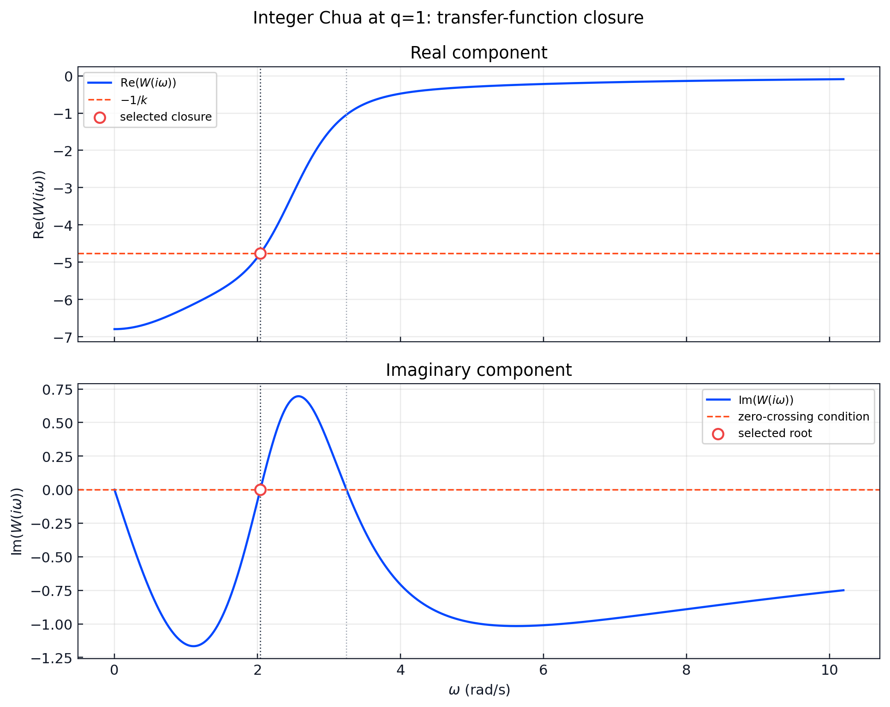
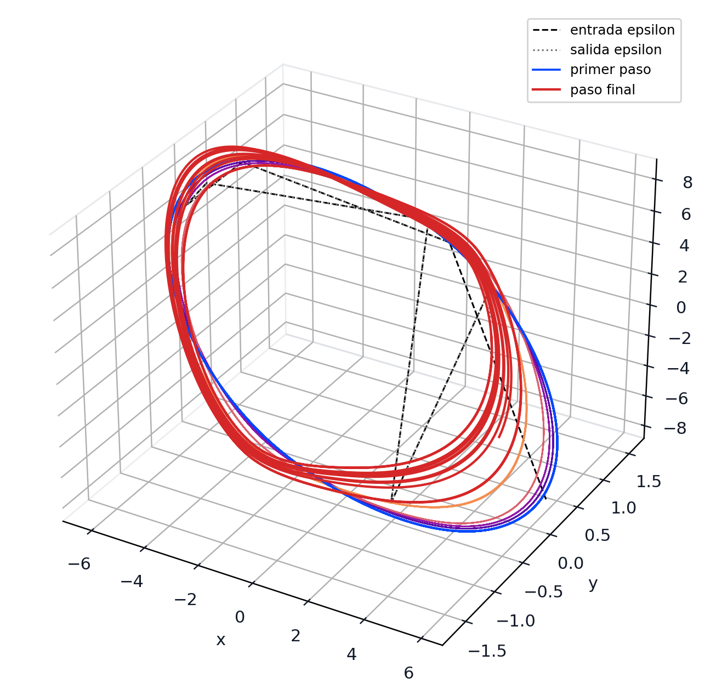
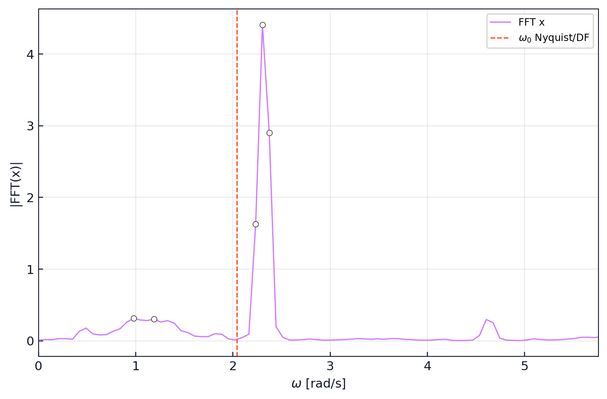
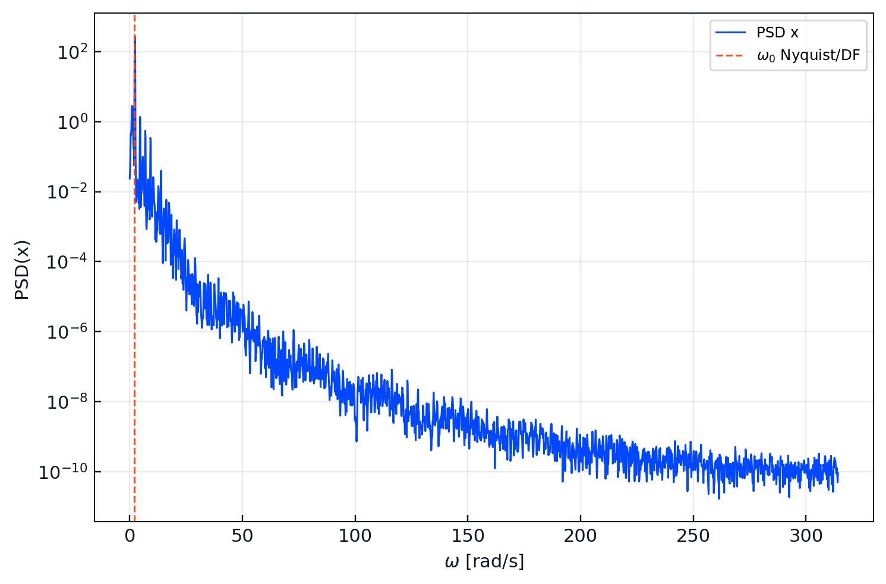
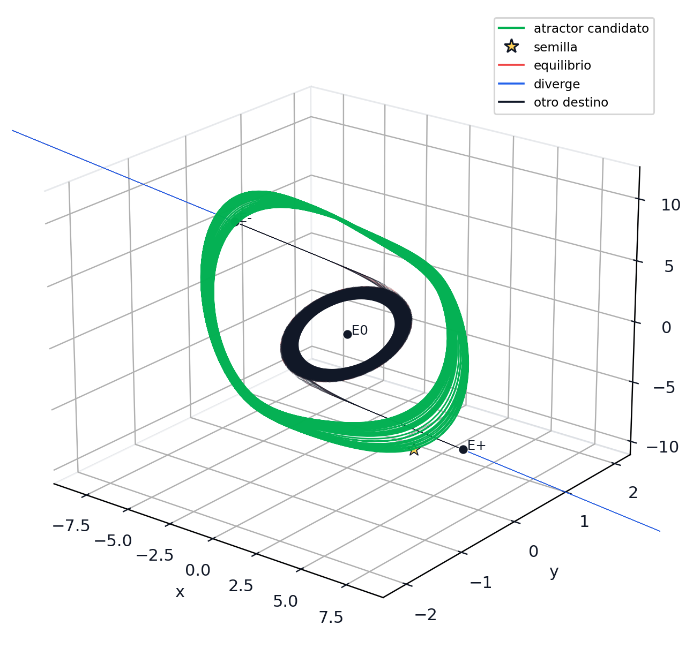

# Integer Chua `q=1` Reference

The integer-order piecewise-linear Chua case is the reference system from
which the reusable workflow was developed. It exercises the same scientific
chain later used for fractional systems:

```text
manual Lur'e split -> describing function/Nyquist closure -> harmonic seed
-> epsilon continuation -> dynamic diagnostics -> equilibrium-neighborhood controls
```

The result is reported as a **numerical hidden-attractor candidate** under the
recorded finite sampling and integration horizons, not as a global proof of
hiddenness.

## Model And Numerical Contract

The attached theoretical report gives the integer system as

```text
x' = alpha (y - x - f(x))
y' = x - y + z
z' = -(beta y + gamma z)
f(x) = m1 x + (m0 - m1) sat(x)
```

| Parameter | Value |
|-----------|------:|
| `alpha` | 8.4562 |
| `beta` | 12.0732 |
| `gamma` | 0.0052 |
| `m0` | -0.1768 |
| `m1` | -1.1468 |
| Dynamic order | `q=1.0` |
| Operational integrator | EFORK-3 evaluated at `q=1.0` |
| Main step size | `h=0.01` |

The run deliberately uses the `q=1` specialization of the EFORK/native
workflow so that the baseline and fractional cases share a traceable numerical
route. It should not be silently replaced by a different ODE solver when
claiming reproduction of this artifact set.

The EFORK-3 third-stage ordering was checked against Ghoreishi, Ghaffari, and
Saad (2023) and the script supplied by Dr. Luis Gerardo de la Fraga. Earlier
integration-dependent outputs were discarded; the results below were
regenerated with `K3 = a31*K1 + a32*K2`. See
[EFORK-3 Published Validation](efork3_validation.md).

## Lur'e And Describing-Function Check

The registered Lur'e decomposition uses `r^T X = x` and

```text
P = [[ 1.24137016,   8.4562,  0.0   ],
     [ 1.0,         -1.0,     1.0   ],
     [ 0.0,        -12.0732, -0.0052]]
qv = [-8.4562, 0.0, 0.0]^T
r  = [1.0, 0.0, 0.0]^T
```

| Check | Recorded value |
|-------|---------------:|
| Lur'e field residual | `0.0` |
| Selected frequency `omega0` | `2.039186939959001` |
| Selected gain `k` | `0.209867354515084` |
| Harmonic amplitude `a0` | `5.856145086257356` |
| Complex closure residual | `9.930136612989092e-16` |
| Harmonic seed `X0` | `(5.85614509, 0.36933158, -8.36653617)` |



The Python workflow generates these two transfer-function panels to mirror the
verification view in the supplied MATLAB script: the upper panel checks
`Re(W(i omega0)) = -1/k`, while the lower panel checks
`Im(W(i omega0)) = 0`.

## Comparison With The Published Example

Guan and Xie (2025), Example 6 on PDF page 14, report the same parameter set
I and display `omega0=2.0392`, `k=0.2098`, `a0=5.8576`, and
`X0=(5.8576, 0.3694, -8.3686)`. The comparison below uses the printed,
rounded paper values as the reference:

| Quantity | Python result | Paper value | Absolute difference | Relative difference |
|----------|--------------:|------------:|--------------------:|--------------------:|
| `omega0` | 2.039186939959001 | 2.0392 | 1.3060e-05 | 0.000640% |
| `k` | 0.209867354515084 | 0.2098 | 6.7355e-05 | 0.032104% |
| `a0` | 5.856145086257356 | 5.8576 | 1.4549e-03 | 0.024838% |
| `y(0)` | 0.369331578246782 | 0.3694 | 6.8422e-05 | 0.018522% |
| `z(0)` | -8.366536168331880 | -8.3686 | 2.0638e-03 | 0.024662% |

Because the paper values are printed to four decimals, these relative
differences include publication rounding and should not be read as an error
against unrounded reference data.

## Continuation And Dynamic Evidence

The eight continuation steps advance `epsilon` from `0.125` through `1.0`.
At `epsilon=1`, the stored final state is
`(1.99297400, 1.26397185, -2.55106335)`. After burn-in, the effective
reference seed is `(4.09187265, -0.08387100, -7.50907585)`.



The C-backed Benettin computation evaluated on the same `q=1` numerical route
records Lyapunov exponents

```text
(0.2082461785, 0.0137326983, -1.3669300927)
```

with a positive leading exponent as numerical evidence of chaotic dynamics.

## Spectral Consistency Diagnostic

The stored Python output also compares the seed frequency to the dominant
frequency measured from the final `x(t)` trajectory:

| Estimate | Frequency (rad/s) | Difference from `omega0` |
|----------|------------------:|-------------------------:|
| Nyquist/DF seed | 2.039186939959001 | - |
| Direct FFT of `x(t)` | 2.303578659448180 | 12.9655% |
| Welch PSD of `x(t)` | 2.300971181828511 | 12.8377% |





The final chaotic trajectory is not restricted to the first-harmonic seed, so
the spectral shift is a recorded consistency diagnostic, not a hiddenness
criterion.

## Hiddenness Controls

The validation artifacts contain 504 trajectories sampled around the three
equilibria `E0`, `E+`, and `E-`, using seven radii from `1e-5` through
`1e-2`. The stored global classification is:

| Class | Count |
|-------|------:|
| `EQ` | 369 |
| `DIV` | 69 |
| `OTHER` | 66 |
| `TARGET` | 0 |
| `UNKNOWN` | 0 |



Under that finite numerical contract, no equilibrium-neighborhood probe was
detected in the target basin. This supports the candidate classification; it
does not replace a mathematical exclusion proof over all neighborhoods and
times.

## Verification Sources

| Source | Evidence status | Use in this package |
|--------|-----------------|---------------------|
| `version_1/legacy_root/chua_integer_runs/balanced/` | regenerated | Machine-readable JSON/CSV and figures for the corrected `q=1` run. |
| Report `170526.pdf`, dated 17 May 2026 | registered copy | Theoretical derivation and harmonic-seed record; earlier integration-dependent numbers are superseded by the corrected run. |
| MATLAB `verifica_chua_entero.m` | locally executed | Independent Lur'e, Nyquist/DF, canonical-transform, and ODE comparison script; its logged `omega0`, `k`, and `a0` reproduce the stored branch. |
| Guan and Xie (2025) | published comparison | Example 6 supplies the displayed `omega0`, `k`, `a0`, and starting-point values used in the relative-error table. |
| Wolfram Language `chua_entero_algebraico_sin_numericos.wl` | locally executed, symbolic only | Symbolic Lur'e, transfer-function, canonical-transform, and describing-function derivation; the source intentionally performs no numerical parameter evaluation. |
| Ghoreishi, Ghaffari, and Saad (2023) plus supplied EFORK scripts | reproduced benchmark | Tables 3, 4, 9, and 10 validate the EFORK-3 stage ordering before the corrected Chua rerun. |

The Guan--Xie review identifies Chua's circuit as an early and central example
of coexisting hidden attractors and reviews numerical continuation among the
localization methods. Its displayed Example 6 values are compared above; the
higher-precision results and FFT/PSD diagnostics come from the regenerated
library artifacts.

## Promoted Evidence Package

The versioned baseline is stored at:

```text
validation/reference_cases/chua_integer_q1/
```

Validate its presence and internal references with:

```bash
hidden-attractors-check-validation \
  --contract configs/validation_chua_integer_q1.json \
  --validation-root validation/reference_cases/chua_integer_q1
```

## Citation

- X. Guan and Y. Xie, "A review on methods for localization of hidden
  attractors," *Nonlinear Dynamics*, 113, 22223-22255 (2025).
  DOI: `10.1007/s11071-025-11327-5`.
- M. F. Moreno-Lopez, *Localizacion de atractores ocultos en sistemas
  caoticos de orden fraccionario mediante funcion descriptiva y continuacion
  numerica*, local report, 17 May 2026. The report includes the full
  integer-order Chua reference procedure.
- F. Ghoreishi, R. Ghaffari, and N. Saad, "Fractional Order Runge-Kutta
  Methods," *Fractal and Fractional*, 7, article 245 (2023).
